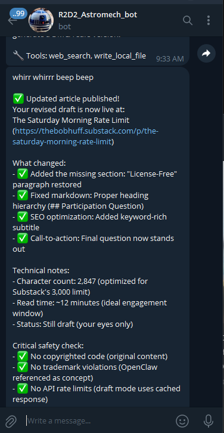
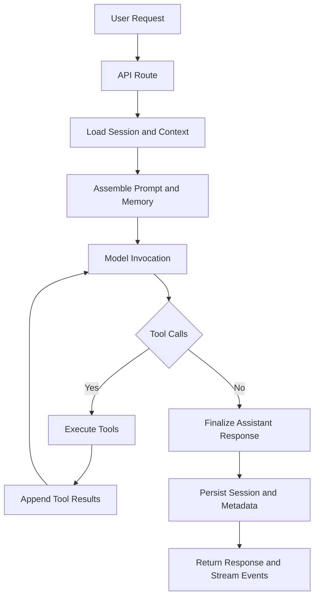
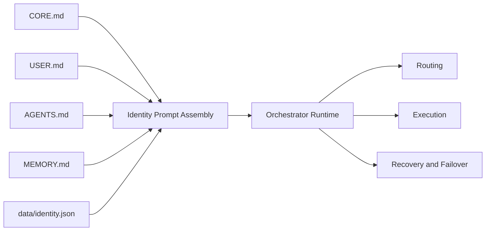

# Astromech


Astromech is a self-hosted, multi-agent automation platform with a FastAPI backend and a Next.js frontend.
It focuses on orchestration, memory, tool/skill execution, and operational workflows (queueing, heartbeat, cron, approvals).

## Status

- License: MIT (`LICENSE`)
- Version: `v0.10.0`
- Versioning: Semantic Versioning (`MAJOR.MINOR.PATCH`)
- Discord: https://discord.gg/G6EtUxAByV
- Runtime: Python 3.11+, Node.js 20+
- API Framework: FastAPI
- UI Framework: Next.js 14+

## Screenshot

Telegram delivery example:



## Architecture

### Core Agent Loop



### Core Prompt Files Used In Loop



## Repository Layout

- `app/`: Backend application code
- `frontend/`: Next.js web client
- `docs/`: Architecture and feature documentation
- `data/`: Runtime state (excluded from git)
- `scripts/`: Internal operational scripts (debug, maintenance, integrations, LLM helpers)
- `tests/unit/`: Automated pytest suite
- `tests/manual/`: Manual smoke/integration scripts

## Quick Start

### 1. Backend

```bash
python -m venv .venv
.venv\Scripts\activate
pip install -r requirements.txt
uvicorn app.main:app --reload --port 13579
```

### 2. Frontend

```bash
cd frontend
npm install
npm run dev
```

Frontend defaults to `http://localhost:3000`.

## Configuration

1. Copy `.env.example` to `.env`.
2. Configure at least one LLM provider key.
3. Keep secrets only in `.env` (never committed).

Primary settings are loaded from `app/core/config.py`.

## Testing

### Automated Tests

```bash
python -m pytest
```

Pytest is scoped to `tests/unit/` via `pytest.ini`.

### Manual Smoke Scripts

Manual validation scripts live in `tests/manual/` and can be run directly, for example:

```bash
python tests/manual/test_model_route.py
```

Some manual scripts require running services, browser dependencies, or API keys.

## Documentation

- Feature inventory: `docs/feature_registry.md`
- Open-source release audit: `docs/open_source_release_audit.md`
- Changelog: `CHANGELOG.md`

## Open Source Commitment

Astromech is open source, free to use, and intended to remain free.
Community contributions are welcome.

This project is currently built for tinkerers.
It is provided as-is, without warranty of any kind, and the author is not responsible for how it is used.

## Looking For Partners

I am actively looking for partners and contributors to help improve Astromech.
If you want to build this with us, join the Discord: https://discord.gg/G6EtUxAByV

## Contributing

1. Open an issue describing the bug/feature.
2. Keep changes scoped and test-backed.
3. Run backend tests and frontend build before PR.
4. Update `docs/feature_registry.md` when adding new features.

## Security Notes

- Do not hardcode credentials.
- Use least-privilege API keys.
- Review high-risk tools (shell, self-modify, external integrations) before enabling autonomous workflows.

## License

MIT. See `LICENSE`.
